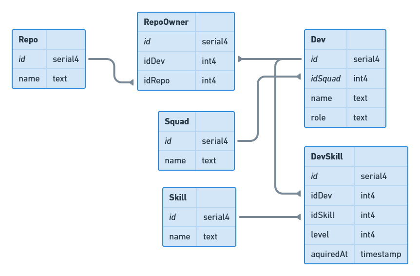

# 🥇 DevFriends backend bootstrapper

Here is a project to do some backend stuffs. Let's have some fun! ✨

[](https://open.vscode.dev/jpb06/dev-friends-backend-starter)

## ⚡ Requirements

You will need the following to work on this workshop:

| Item      | Description                                              | Documentation                               |
| --------- | -------------------------------------------------------- | ------------------------------------------- |
| ⚙️ nodejs | Duh!                                                     | https://nodejs.org/en/                      |
| 🐳 Docker | we will use docker to launch a postgres instance         | https://www.docker.com/get-started          |
| 🧶 yarn   | We will use yarn as the package manager for this project | https://yarnpkg.com/getting-started/install |

## ⚡ Stack

| Item          | Description                                                                     | Documentation                                      |
| ------------- | ------------------------------------------------------------------------------- | -------------------------------------------------- |
| 😹 nestjs     | Nest is a cool framework to build backends (brace yourself, decorators inbound) | https://docs.nestjs.com/                           |
| 🛆 prisma      | Prisma will be our ORM to interract with the database                           | https://www.prisma.io/docs/getting-started         |
| 🃏 jest       | We will use jest to write our tests                                             | https://jestjs.io/fr/docs/getting-started          |
| 🖊️ eslint     | Linting all the things!                                                         | https://eslint.org/docs/user-guide/getting-started |
| 🤩 Typescript | Types, types everywhere                                                         | https://www.typescriptlang.org/docs/               |

## ⚡ How to start

### 🔶 Firstof, let's start our database using docker

```bash
yarn start:db
```

### 🔶 Launching our tests

```bash
yarn test:watch
```

### 🔶 Launching our backend in dev mode

```bash
yarn start:dev
```

### 🔶 Building our app for production

```bash
yarn build
```

## ⚡ Data model

Our sample database contains developers along with their squads, their skills and their ownerships on repositories.

Let's take a look at the schema:



## ⚡ Give me features to complete now!

### 🔶 Guidelines

| Guideline                       | Description                                                                                   |
| ------------------------------- | --------------------------------------------------------------------------------------------- |
| 💪 Use only typescript          | No javascript allowed!                                                                        |
| 💪 Be modular                   | nestjs is based on the same principles as angular. Remember modules are cool!                 |
| 💪 Follow RESTful principles    | Define your endpoints in the most logical way from these principles                           |
| 💪 Make sure to validate inputs | Endpoints should return a specific response when input is invalid                             |
| 💪 Standardize responses        | If a resource is not found, return a 400 response, if something goes wrong, return a 500, etc |
| 💪 Test your code               | Make sure the codebase is properly tested                                                     |

### 🔶 Provide an endpoint to get all squads with their developers

This endpoint should return an array of objects containing squads data and an array of developers.

#### ✅ Expected output

```
{
  result: [
    {
      id: number,
      name: string,
      devs: [
        {
          id: number,
          name: string,
          role: string
        }
      ]
    },
    // ...
  ]
}

```

### 🔶 Provide an endpoint to get a developer

This endpoint should return an object contains the dev infos as well as his squad, his skills and his ownerships.

#### ▶️ Input

```
developer id (number)
```

#### ✅ Expected output

```
{
  result: {
    id: number,
    name: string,
    squad: {
      id: number,
      name: string,
    },
    skills: [
      {
        id: number,
        name: string,
        level: number,
        aquiredAt: Date
      },
      // ...
    ],
    ownerships: [ // repos
      {
        id: number,
        name: string
      },
      // ...
    ]
  }
}
```

### 🔶 Provide an endpoint to get all the developers matching a skill

#### ▶️ Input

```
skill id (number)
```

#### ✅ Expected output

```
{
  "result": [
    {
      id: number,
      name: string,
      level: number,
      aquiredAt: Date
    }
    // ...
  ]
}
```

### 🔶 Provide an endpoint to change the squad of a developer

#### ▶️ Input

```
developer id (number)
```

#### ✅ Expected output

```
{
  "result": {
    id: number,
    name: string,
    squad: {
      id: number,
      name: string,
    },
  }
}
```

### 🔶 Add swagger to the stack and fully document each route

#### ✅ Expected result

- Inputs should be documented
- Outputs (possible responses) should all be documented
- A description of the route should be present
